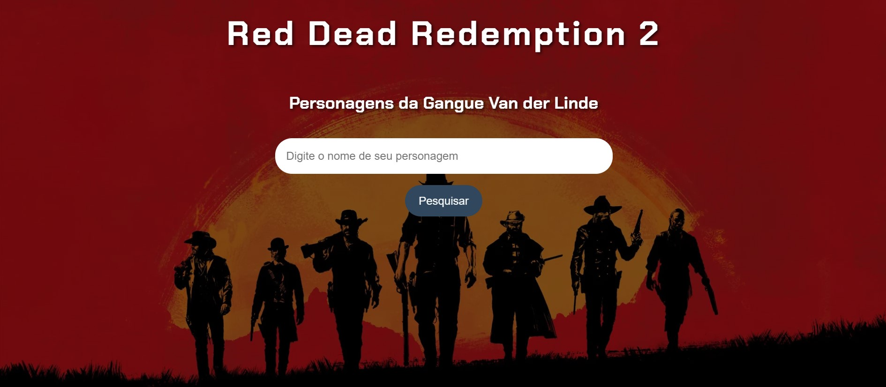
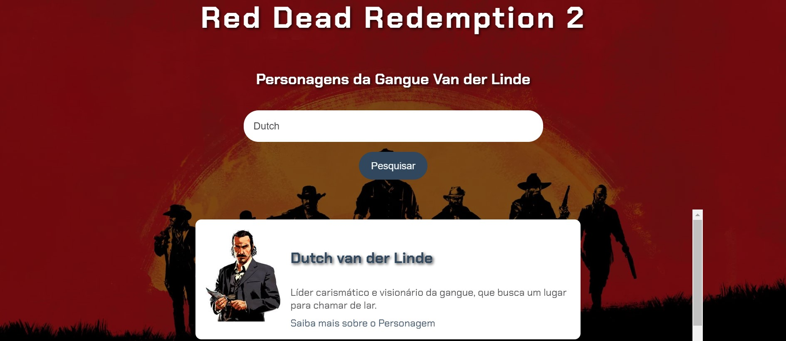

# Imersao_DevAlura
Repositório destinado ao meu projeto feito na semana de imersão da Alura com Google Gemini

## OBS: ainda estou desenvolvendo

 

# **Red Dead Redemption 2: Enciclopédia da Gangue Van der Linde** 

**O que é isso?**

Já se perguntou tudo sobre os personagens da gangue mais famosa do Velho Oeste? Essa aplicação te ajuda a descobrir! 

**Como funciona?**

1. **Digite o nome:** Comece digitando o nome do personagem que você quer saber mais.
2. **Mágica da busca:** A aplicação procura por esse nome na nossa base de dados super secreta (ok, não é tão secreta assim, está tudo em `dados.js`).
3. **Resultados instantâneos:** Se encontrar alguma coisa, te mostra um card com o nome, uma descrição bem legal e até um link para um vídeo com mais detalhes. 

**Tecnologias utilizadas:**

* **HTML:** A estrutura básica da página, pra deixar tudo bonitinho.
* **CSS:** Aquele toque final de estilo, pra deixar a página com a cara do Velho Oeste.
* **JavaScript:** A inteligência por trás da aplicação, fazendo a busca e montando os resultados.

**Como usar:**

1. **Clone o repositório:** Use o bom e velho `git clone` para baixar o projeto pra sua máquina.
2. **Abra o index.html:** Dê um duplo clique no arquivo `index.html` e pronto! A aplicação vai abrir no seu navegador.
3. **Comece a explorar:** Digite o nome de um personagem e veja a mágica acontecer!

**Observações:**

* **Dados:** Todos os dados dos personagens estão armazenados no arquivo `dados.js`. Se você quiser adicionar mais personagens, é só editar esse arquivo.
* **Design:** O design da página é bem simples, mas dá pra personalizar do jeito que você quiser. Mexa no arquivo `styles.css` para dar aquele toque pessoal.
* **Melhorias:** A aplicação ainda está em desenvolvimento, então pode ter alguns bugs ou funcionalidades faltando. Se você encontrar algum problema, pode abrir uma issue aqui no GitHub.

**Contribuições:**

Se você quiser contribuir para o projeto, fique à vontade! Pode abrir um pull request com suas melhorias.

**Aviso:**

Essa aplicação é apenas para fins de diversão e aprendizado. Não garanto a precisão das informações contidas nela. 

**Créditos:**

* **Alura:** Agradeço à Alura pela imersão que me inspirou a criar essa aplicação.
* **Rockstar Games:** Por criar um jogo tão maravilhoso como Red Dead Redemption 2.

**Divirta-se explorando o mundo de Red Dead Redemption 2!**
